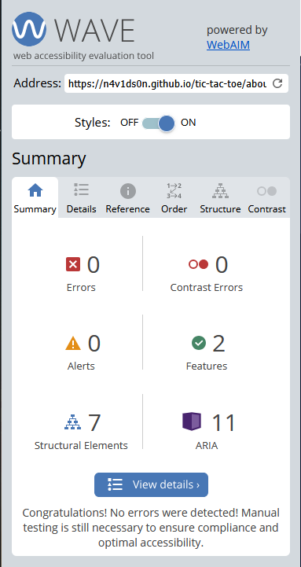
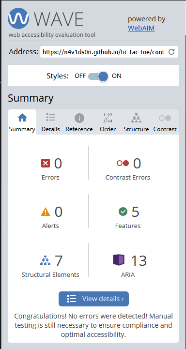
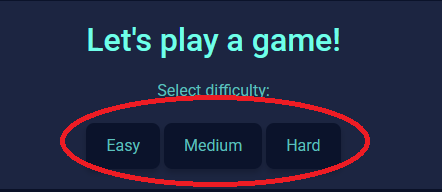

# Testing

 1. [HTML Validation](#HTML-validation)
 2. [CSS Validation](#CSS-validation)
 3. [JS Validation](#JS-Validation)
 4. [Accessibility](#accessibility)
 5. [Performance](#performance)
 6. [Device testing](#performing-tests-on-various-devices)
 7. [Browser compatibility](#browser-compatability)
 8. [Testing user stories](#testing-user-stories)

> Return back to the [README.md](readme.md) file.

## Code Validation

### HTML-validation

[HTML W3C Validator](https://validator.w3.org) was used to validate html pages:

| Directory | File | URL | Screenshot |
| --- | --- | --- | --- |
| root | [404.html](https://github.com/n4v1ds0n/tic-tac-toe/blob/main/404.html) | [HTML Validator](https://validator.w3.org/nu/?doc=https://n4v1ds0n.github.io/tic-tac-toe/404.html) |  |
| root | [about.html](https://github.com/n4v1ds0n/tic-tac-toe/blob/main/about.html) | [HTML Validator](https://validator.w3.org/nu/?doc=https://n4v1ds0n.github.io/tic-tac-toe/about.html) |  |
| root | [contact.html](https://github.com/n4v1ds0n/tic-tac-toe/blob/main/contact.html) | [HTML Validator](https://validator.w3.org/nu/?doc=https://n4v1ds0n.github.io/tic-tac-toe/contact.html) |  |
| root | [index.html](https://github.com/n4v1ds0n/tic-tac-toe/blob/main/index.html) | [HTML Validator](https://validator.w3.org/nu/?doc=https://n4v1ds0n.github.io/tic-tac-toe/index.html) |  |
| root | [strategy.html](https://github.com/n4v1ds0n/tic-tac-toe/blob/main/strategy.html) | [HTML Validator](https://validator.w3.org/nu/?doc=https://n4v1ds0n.github.io/tic-tac-toe/strategy.html) |  |

### CSS-validation

[CSS Jigsaw Validator](https://jigsaw.w3.org/css-validator) was used to validate the custom stylesheet.

| Directory | File | URL | Screenshot |
| --- | --- | --- | --- |
| assets | [style.css](https://github.com/n4v1ds0n/tic-tac-toe/blob/main/assets/css/style.css) | [CSS Validator](https://jigsaw.w3.org/css-validator/validator?uri=https://n4v1ds0n.github.io/tic-tac-toe) |  |

### JS-validation

[JShint Validator](https://jshint.com/) was used to validate JavaScript scripts.

| Directory | File | Screenshot |
| --- | --- | --- |
| assets | [contact.js](https://github.com/n4v1ds0n/tic-tac-toe/blob/main/assets/js/contact.js) |  |
| assets | [game.js](https://github.com/n4v1ds0n/tic-tac-toe/blob/main/assets/js/game.js) | , ,  |

## Accessibility

| Page | File | URL | Screenshot |
| --- | --- | --- | --- |
| 404 | [404.html](https://github.com/n4v1ds0n/tic-tac-toe/blob/main/404.html)| [WAVE Report](https://wave.webaim.org/report#/https://n4v1ds0n.github.io/tic-tac-toe/404)|  |
| about | [about.html](https://github.com/n4v1ds0n/tic-tac-toe/blob/main/about.html)| [WAVE Report](https://wave.webaim.org/report#/https://n4v1ds0n.github.io/tic-tac-toe/about.html)|  |
| contact| [contact.html](https://github.com/n4v1ds0n/tic-tac-toe/blob/main/contact.html)| [WAVE Report](https://wave.webaim.org/report#/https://n4v1ds0n.github.io/tic-tac-toe/contact.html)|  |
| index | [index.html](https://github.com/n4v1ds0n/tic-tac-toe/blob/main/index.html)| [WAVE Report](https://wave.webaim.org/report#/https://n4v1ds0n.github.io/tic-tac-toe/index.html)|  |
| strategy | [strategy.html](https://github.com/n4v1ds0n/tic-tac-toe/blob/main/strategy.html)| [WAVE Report](https://wave.webaim.org/report#/https://n4v1ds0n.github.io/tic-tac-toe/strategy.html)|  |

## Performance

| Page | File | Screenshot |
| --- | --- | --- |
| 404 | [404.html](https://github.com/n4v1ds0n/tic-tac-toe/blob/main/404.html)|  |
| about | [about.html](https://github.com/n4v1ds0n/tic-tac-toe/blob/main/about.html)|  |
| contact | [contact.html](https://github.com/n4v1ds0n/tic-tac-toe/blob/main/contact.html)|  |
| index | [index.html](https://github.com/n4v1ds0n/tic-tac-toe/blob/main/index.html)|  |
| strategy | [strategy.html](https://github.com/n4v1ds0n/tic-tac-toe/blob/main/strategy.html)|  |

### Performing tests on various devices
The pages were testet on:
- Desktop pc
- Samsung Galaxy A52
- Samsung Galaxy A...
- Kindle fire tablet

### Browser compatibility

- Mozilla Firefox
- Google Chrome
- Microsoft Edge

### Testing user stories

1. As a user, I want to be able to choose a game mode.

| **Feature** | **Action** | **Expected Result** | **Actual Result** |
|-------------|------------|---------------------|-------------------|
| Mode Selection | On home page, click on single- or multiplayer button | Reach difficulty selection for singleplayer or start a multiplayer game | Works as expected |

Screenshots

2. As a user, I want to choose a difficulty level when playing alone.

| **Feature** | **Action** | **Expected Result** | **Actual Result** |
|-------------|------------|---------------------|-------------------|
| Difficulty Selection | After choosing single player mode, click easy medium or hard button | start a game with respective difficulty | Works as expected |

Screenshots

3. As a user, I want to play with a friend.

| **Feature** | **Action** | **Expected Result** | **Actual Result** |
|-------------|------------|---------------------|-------------------|
| Multi Player with Turn-Based Gameplay | In mode selection click multiplayer | start a multiplayer game | Works as expected |

Screenshots

4. As a user, I want to track my wins.

| **Feature** | **Action** | **Expected Result** | **Actual Result** |
|-------------|------------|---------------------|-------------------|
| Game Outcome Feedback | Play a game until its over | Receive an outcome alert and the score is updated | Works as expected |

Screenshots

5. As a user, I want to know how to improve at the game.

| **Feature** | **Action** | **Expected Result** | **Actual Result** |
|-------------|------------|---------------------|-------------------|
| Strategy Guide Page | Go to page via navigation | Receive a number of strategy hints and tips | Works as expected |

Screenshots

6. As a user I want to learn about the premise of the game app.

| **Feature** | **Action** | **Expected Result** | **Actual Result** |
|-------------|------------|---------------------|-------------------|
| About page| Go to page via navigation| Receive a short text explainig the project scope and game logic | Works as expected |

Screenshots

7. As a user, I want to share feedback or contact the creator.

| **Feature** | **Action** | **Expected Result** | **Actual Result** |
|-------------|------------|---------------------|-------------------|
| Footer | click Contact us | Get to contact form | Works as expected |
| Contact Form | Enter information and click submit | receive confirmation message | Works as expected |

Screenshots

8. As the site owner, I want users to give feedback on the site

| **Feature** | **Action** | **Expected Result** | **Actual Result** |
|-------------|------------|---------------------|-------------------|
| Contact Form| User submits information | emailjs sends message to site owner | Works as expected |

Screenshots

No screenshots available. But emails are received by site owner.

9. As the site owner, I want to provide my contact information to visitors interested in my work

| **Feature** | **Action** | **Expected Result** | **Actual Result** |
|-------------|------------|---------------------|-------------------|
| Footer | Click github or linkedin icon| Get to site owners profiles | Works as expected |

Screenshots

